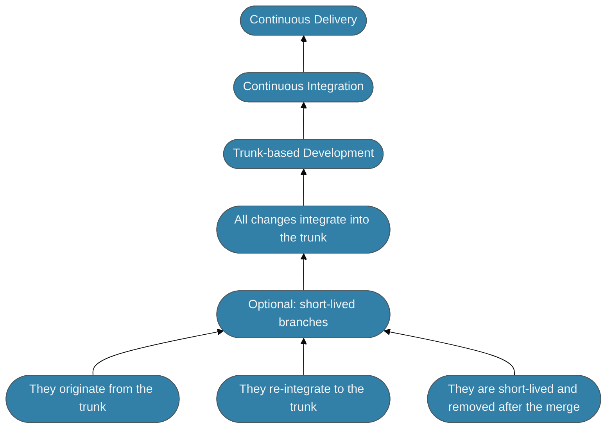

See [MinimumCd.org](https://minimumcd.org)

```mermaid
%%{init: {'securityLevel': 'loose', 'theme': 'base', 'themeVariables': { 'primaryColor': '#327fa8', 'primaryTextColor': '#f0f3f5'}}}%%
graph BT
TBD([Trunk-based Development])-->CI
CI([Continuous Integration])-->CD([Continuous Delivery])
DTT([All changes integrate into the trunk])-->TBD
SLFB([Optional: short-lived branches])-->DTT
A([They originate from the trunk])-->SLFB
B([They re-integrate to the trunk])-->SLFB
C([They are short-lived and removed after the merge])-->SLFB

```

